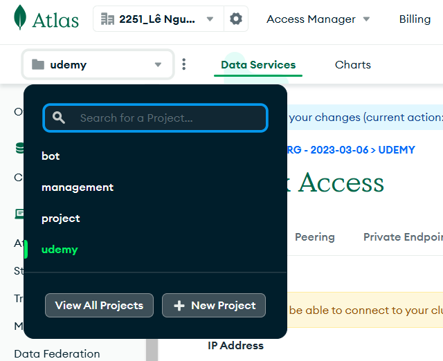
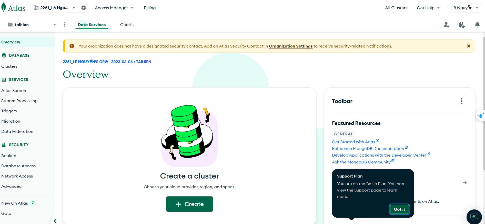
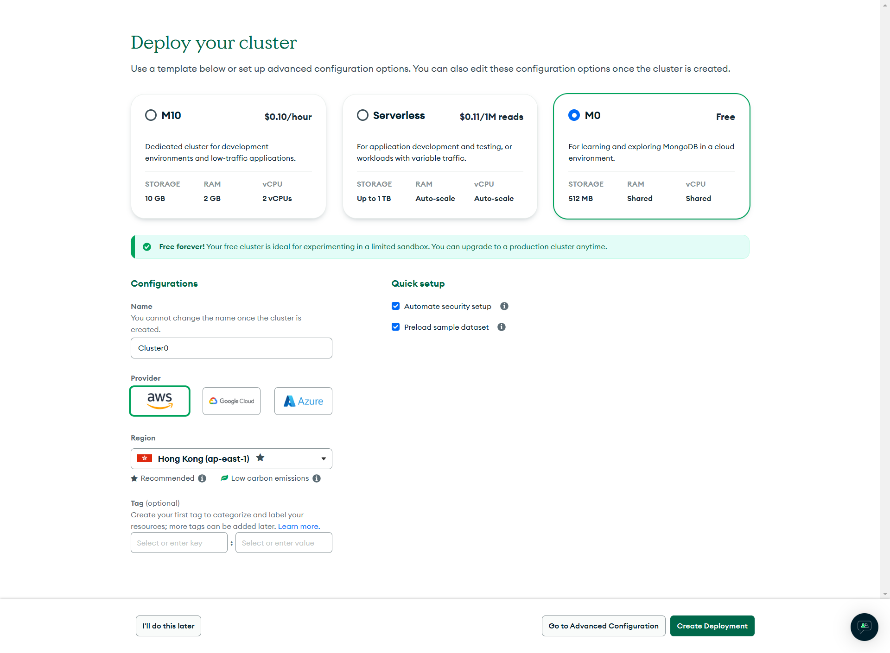
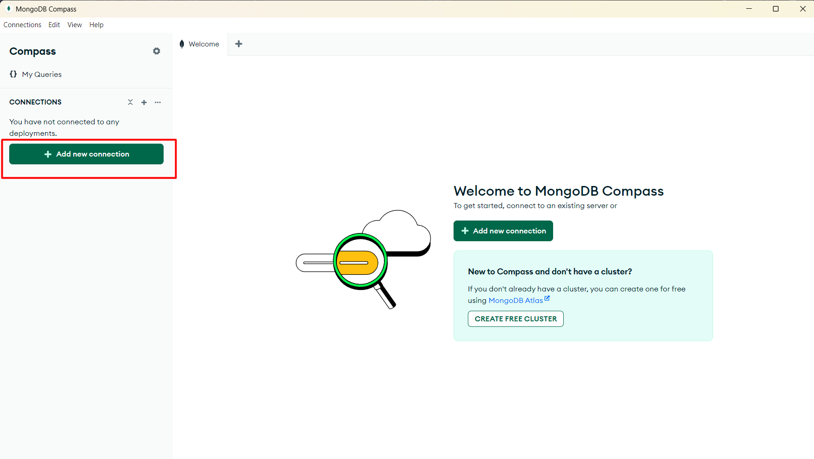
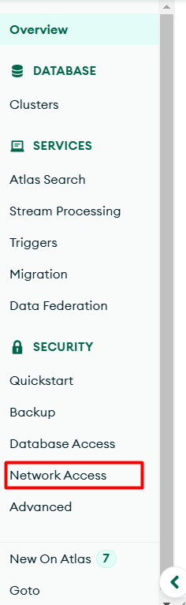
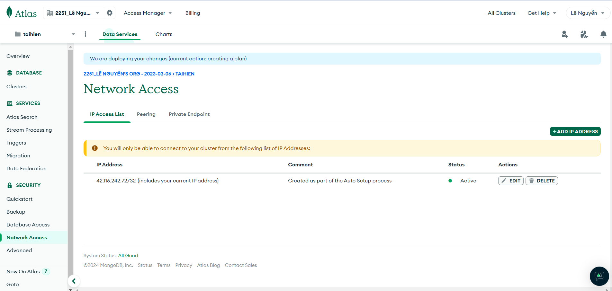
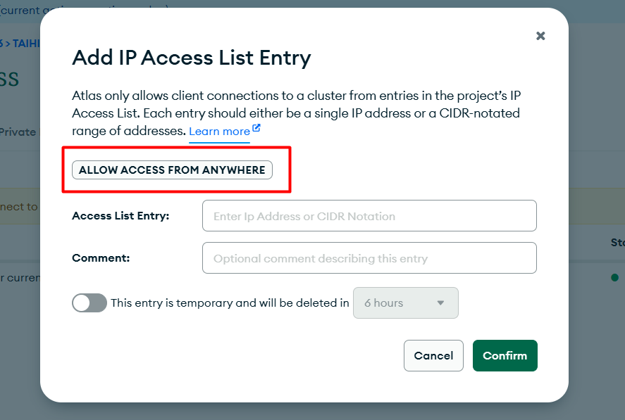

# MongoDB

## 1. Hướng dẫn sử dụng mongodb

1. Mở trang `https://www.mongodb.com/` => try atlas free => đăng nhập
2. Tại gốc trái bấm `New Project`  => Đặt tên => next => create project


3. Bấm vào `Create a Cluster` => Chọn `M0` => Còn lại chọn mặc định => `Create Deployment`




4. Tại pop up `Connect to Cluster0` => `Create Database User` => `Choose Connection Method` => `Compass` 

5. Chọn `I have MongoDB Compass Installed` => `Copy`

6. Mở MongoDB Compass => `Connect` => `Add New Connection` => dán connection string vào => `Đặt tên` => `Save and Connect`



7. Bấm vào `done`

8. Để mọi người có thể truy cập được database => `Network Access` => `Add IP Address` => `Allow Access from Anywhere` => `Confirm`





## 2. Các thao tác với MongoDB
- Bấm vào `Database` => `Browse Collections` => `Create Database` => `Create Collection`

# 3.  Các khái niệm

### Mongoose: 
- là một package giúp tương tác với MongoDB thông qua các model và schema.
- **Schema**: là một đối tượng dùng để định nghĩa cấu trúc của một collection trong MongoDB. Cho phép định nghĩa các trường (field), kiểu dữ liệu (data types) và các ràng buộc (constraints).
- **Model**: là một đối tượng dùng để tạo, đọc, cập nhật và xóa các document trong MongoDB. Mỗi model tương ứng với một collection trong MongoDB.

- Ví dụ: 1 `collection` có `document` là :

```json
{
    "name": "John",
    "age": 30,
    "email": "john@example.com"
}
```

